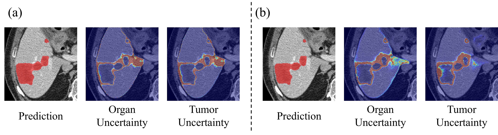
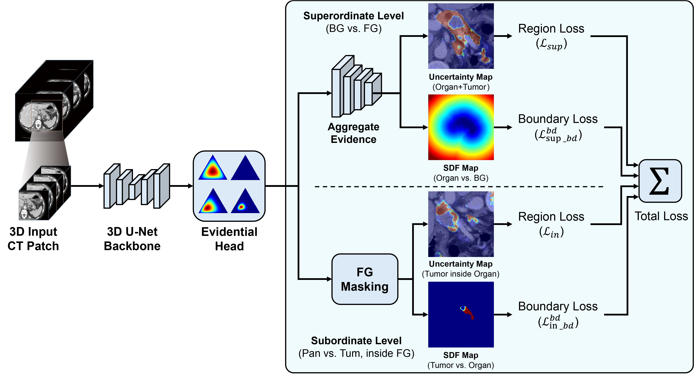

# HiEDL: Hierarchical Evidential Deep Learning for Uncertainty-Aware Tumor Segmentation

Official implementation of **HiEDL: Hierarchical Evidential Deep Learning for Uncertainty-Aware Tumor Segmentation from 3D CT via Boundary Regularization** (**Accepted at MICCAI 2026** 🎉).

HiEDL accurately and efficiently segments tumors from 3D CT scans by explicitly enforcing the anatomical *containment prior* — the fact that tumors physically reside within their corresponding organs. It combines a hierarchical organ-to-tumor decoupling strategy with evidential deep learning and a novel boundary regularization loss to resolve ambiguous tumor boundaries while quantifying predictive uncertainty.

---

## Motivation

<p align="center">
  
</p>

Conventional flat classification ignores the prior that tumors physically reside within organs, causing severe errors (a). Predictive tumor uncertainty is highest at the **inner organ–tumor boundary**, rather than at the outer organ boundary (b). HiEDL is designed to exploit exactly this structure.

---

## Highlights

- **Hierarchical evidential formulation.** The segmentation task is decoupled into a *superordinate* level (localizing the encompassing organ) and a *subordinate* level (isolating the target tumor inside the organ), explicitly enforcing the anatomical containment prior instead of treating organs and tumors as flat, mutually exclusive classes.
- **Uncertainty-aware boundary regularization.** A boundary loss based on Signed Distance Functions (SDF) is integrated with evidential uncertainty to penalize over-confident misclassifications at ambiguous organ–tumor borders.
- **Reliable uncertainty estimation.** Built on Evidential Deep Learning (EDL), HiEDL models predictions as a Dirichlet distribution, providing per-voxel uncertainty maps in a single forward pass — without expensive Bayesian approximations.
- **State-of-the-art performance.** Highest region-level (Dice) and boundary-level (NSD) scores on the MSD Pancreas and MSD Liver datasets.

---

## Method Overview

<p align="center">
  
</p>

Given an input CT volume, HiEDL employs an evidential segmentation model that outputs a voxel-wise three-class Dirichlet prediction over {background, organ, tumor}. The three-class task is decomposed at the loss level into two hierarchical sub-problems:

1. **Superordinate level** — background vs. organ–tumor foreground.
2. **Subordinate level** — organ vs. tumor discrimination within the foreground.

Each level is supervised by both a **region loss** (evidential Dice) and a **boundary loss** (SDF-based distance map). The overall training objective is:

```
L = w_sup · L_sup + w_in · L_in + λ_sup(t) · L_sup^bd + λ_in(t) · L_in^bd
```

where `w_sup`, `w_in` are constant region-loss weights and `λ(t)` is a time-dependent ramp-up schedule for the boundary losses.

---

## Results

### Comparison with 3D segmentation networks

| Model        | MSD Pancreas Dice ↑ | MSD Pancreas NSD ↑ | MSD Liver Dice ↑ | MSD Liver NSD ↑ |
|--------------|:-------------------:|:------------------:|:----------------:|:---------------:|
| UNETR        | 0.2035              | 0.3261             | 0.3090           | 0.2745          |
| UNETR++      | 0.3213              | 0.4669             | 0.5002           | 0.4474          |
| SegResNet    | 0.3990              | 0.5460             | 0.6287           | 0.6682          |
| Swin UNETR   | 0.4073              | 0.5811             | 0.6218           | 0.6471          |
| **HiEDL**    | **0.4346**          | **0.5906**         | **0.6542**       | **0.6930**      |

<p align="center">
  
</p>

Visual comparison of different methods for abdominal tumor segmentation. Green and red regions denote the ground truth and predicted tumor, respectively. HiEDL stays close to the ground truth, especially along the ambiguous boundaries between tumors and their organs.

### Ablation study

**MSD Pancreas**

| Components                          | Dice ↑ | NSD ↑  |
|-------------------------------------|:------:|:------:|
| Baseline                            | 0.4073 | 0.5811 |
| Baseline w/ Region loss             | 0.3965 | 0.5574 |
| Baseline w/ Boundary loss (Ours)    | **0.4346** | **0.5906** |

**MSD Liver**

| Components                          | Dice ↑ | NSD ↑  |
|-------------------------------------|:------:|:------:|
| Baseline                            | 0.6218 | 0.6471 |
| Baseline w/ Region loss             | 0.5930 | 0.5758 |
| Baseline w/ Boundary loss (Ours)    | **0.6542** | **0.6930** |

<p align="center">
  
</p>

Predictive uncertainty maps from the ablation study. Red arrows indicate that the proposed boundary loss effectively reduces uncertainty outside the organs in the tumor's uncertainty maps, confining tumor uncertainty within the organ.

---

## Datasets

We evaluate HiEDL on two publicly available CT tumor segmentation datasets from the [Medical Segmentation Decathlon (MSD)](http://medicaldecathlon.com/):

- **MSD Pancreas** — pancreatic tumor segmentation.
- **MSD Liver** — hepatic tumor segmentation.

### Pre-processing

- Truncate voxel intensities to a soft-tissue HU window of `[-125, 225]`, then normalize to `[0, 1]`.
- Resample all volumes to a uniform physical spacing of `1.5 × 1.5 × 2.0 mm³`.
- Randomly crop 3D sub-volumes of size `256 × 256 × 32` during training.

---

## Installation

```bash
git clone https://github.com/laibi-yonsei/HiEDL.git
cd HiEDL

# (recommended) create a virtual environment
conda create -n hiedl python=3.10 -y
conda activate hiedl

# install dependencies
pip install -r requirements.txt
```

> Requires Python 3 and PyTorch. See `requirements.txt` for the full dependency list.

---

## Usage

```bash
# Training
python train.py --dataset pancreas --data_root /path/to/MSD_Pancreas

# Evaluation
python test.py --dataset pancreas --checkpoint /path/to/checkpoint.pth
```

> Adjust the script names and arguments to match your repository structure.

---

## Implementation Details

| Setting              | Value                              |
|----------------------|------------------------------------|
| Optimizer            | AdamW                              |
| Epochs               | 200                                |
| Batch size           | 1                                  |
| Initial learning rate| 2 × 10⁻⁴                           |
| Input patch size     | 256 × 256 × 32                     |
| GPU                  | NVIDIA GeForce RTX A6000 (48 GB)   |
| Framework            | PyTorch                            |
| `w_sup`, `w_in`      | 1                                  |
| `λ_sup`, `λ_in`      | 0.2                                |
| `t` (ramp-up)        | 20                                 |

---

## Citation


---

## Acknowledgments

This work was supported by the Regional Innovation System & Education (RISE) program through the Gangwon RISE Center, funded by the Ministry of Education (MOE) and Gangwon State, Republic of Korea (Grant No. 2026-RISE-10-006); the Bio & Medical Technology Development Program of the National Research Foundation of Korea (NRF), funded by the Korean government (MSIT) (Grant No. RS-2024-00440802); and an NRF grant funded by the Korean government (MSIT) (Grant No. 2022R1A2C2091160).

---

## Contact

- Younghyun Park, Jin Gyo Jeong *(equal contribution)*
- Corresponding author: Sejung Yang — `syang@yonsei.ac.kr`

Department of Precision Medicine / Department of Medical Informatics and Biostatistics,
Yonsei University Wonju College of Medicine, Wonju, Korea.
